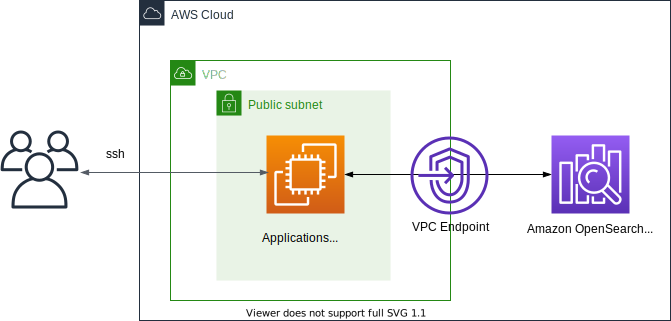
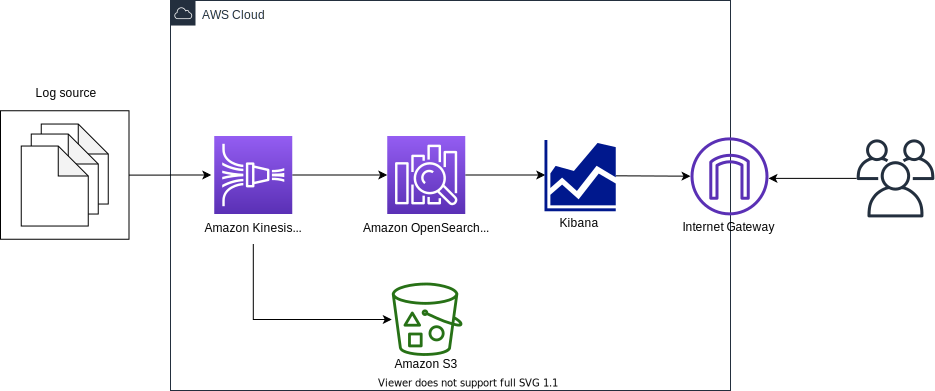

# Amazon OpenSearch Serverless Common Usage Patterns

This repository contains a set of example projects for [Amazon OpenSearch Serverless](https://aws.amazon.com/opensearch-service/features/serverless/)

| Usage Pattern | Architecture | Description |
|---------|-------------|------|
| [Opensearch Serverless for Search usecases](./search) |  | opensearch serverless for search usecases |
| [Opensearch Serverless for Time-series data](./time-series) |  | opensearch serverless for time series analysis |
| [Opensearch Serverless for Vector Search usecases](./vector-search) |  | opensearch serverless for vector search usecases |
| [Opensearch Serverless in VPC](./vpc-endpoint) |  | opensearch serverless in VPC |
| [Opensearch Serverless Streaming ingestion from Kinesis Data Firehose](./kinesis-firehose) |  | data ingestion to opensearch serverless using kinesis firehose |

Enjoy!

## References
 * [Amazon OpenSearch Serverless](https://docs.aws.amazon.com/opensearch-service/latest/developerguide/serverless.html)
 * [(Hands-on) Getting started with Amazon OpenSearch Serverless](https://catalog.us-east-1.prod.workshops.aws/workshops/f8d2c175-634d-4c5d-94cb-d83bbc656c6a/en-US)

## Security

See [CONTRIBUTING](CONTRIBUTING.md#security-issue-notifications) for more information.

## License

This library is licensed under the MIT-0 License. See the LICENSE file.

